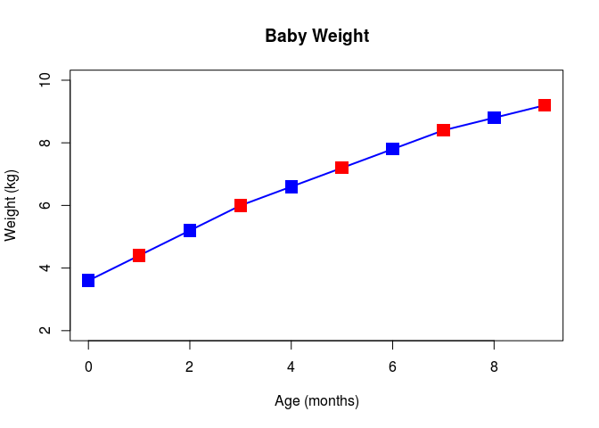
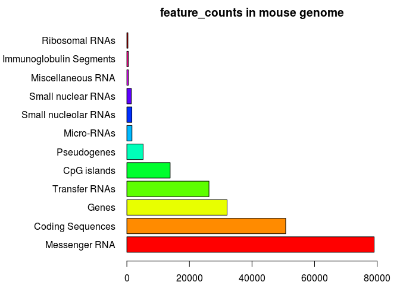
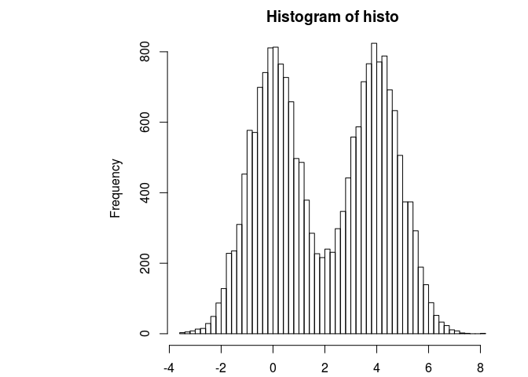
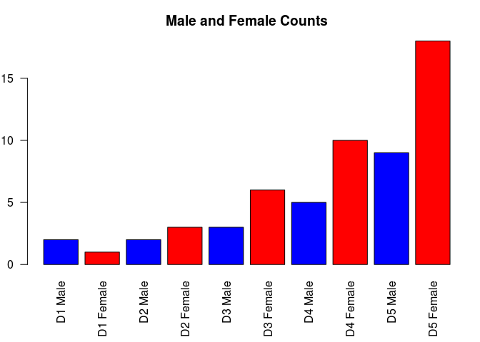
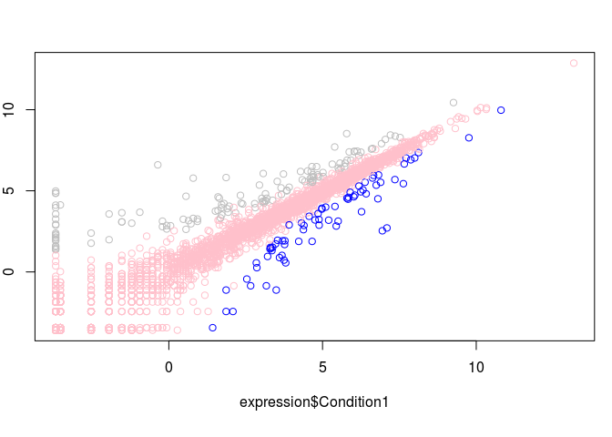

Class05
================
John Lee
January 22, 2019

``` r
weight <- read.table("bimm143_05_rstats/bimm143_05_rstats/weight_chart.txt", header = TRUE)
plot(weight, typ = "o", pch = 15, cex = 2, col =c("blue", "red"), lwd = 2, ylim=c(2,10), xlab = "Age (months)", ylab = "Weight (kg)", main = "Baby Weight")
```



``` r
mouse <- read.table("bimm143_05_rstats/bimm143_05_rstats/feature_counts.txt", header = TRUE, sep ="\t")
## \t separator is for tab spacings

par(mar=c(2.1, 11.1, 2.1, 2))
barplot(mouse$Count, horiz = TRUE, xlab= "Counts", names.arg = mouse$Feature, main = "feature_counts in mouse genome", las = 1, xlim = c(0,80000), col = rainbow(11))
```



``` r
histo <- c(rnorm(10000), rnorm(10000)+4)
hist(histo, breaks=50)        
```



``` r
male <- read.table("bimm143_05_rstats/bimm143_05_rstats/male_female_counts.txt", header = TRUE, sep = "\t")

par(mar=c(5.5, 2, 3, 1))
barplot(male$Count, horiz = FALSE, names.arg = male$Sample, main = "Male and Female Counts", col = c("blue", "red"), las = 2, ylab = "Counts
        ")
```



``` r
expression <- read.table("bimm143_05_rstats/bimm143_05_rstats/up_down_expression.txt", header = TRUE, sep = "\t")
## how many up down and all around?
table( expression$State)
```

    ## 
    ##       down unchanging         up 
    ##         72       4997        127

``` r
palette(c("blue", "pink", "grey"))
plot(expression$Condition1, expression$Condition2, col=expression$State)
```


