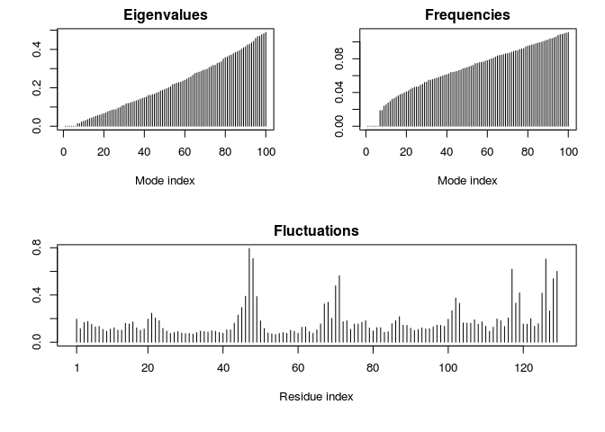

class 13.rmd
================
John Lee
February 19, 2019

``` r
library(bio3d)
hsg.file <- get.pdb("1HSG")
```

    ## Warning in get.pdb("1HSG"): ./1HSG.pdb exists. Skipping download

``` r
hiv <- read.pdb(hsg.file)
```

``` r
hiv
```

    ## 
    ##  Call:  read.pdb(file = hsg.file)
    ## 
    ##    Total Models#: 1
    ##      Total Atoms#: 1686,  XYZs#: 5058  Chains#: 2  (values: A B)
    ## 
    ##      Protein Atoms#: 1514  (residues/Calpha atoms#: 198)
    ##      Nucleic acid Atoms#: 0  (residues/phosphate atoms#: 0)
    ## 
    ##      Non-protein/nucleic Atoms#: 172  (residues: 128)
    ##      Non-protein/nucleic resid values: [ HOH (127), MK1 (1) ]
    ## 
    ##    Protein sequence:
    ##       PQITLWQRPLVTIKIGGQLKEALLDTGADDTVLEEMSLPGRWKPKMIGGIGGFIKVRQYD
    ##       QILIEICGHKAIGTVLVGPTPVNIIGRNLLTQIGCTLNFPQITLWQRPLVTIKIGGQLKE
    ##       ALLDTGADDTVLEEMSLPGRWKPKMIGGIGGFIKVRQYDQILIEICGHKAIGTVLVGPTP
    ##       VNIIGRNLLTQIGCTLNF
    ## 
    ## + attr: atom, xyz, seqres, helix, sheet,
    ##         calpha, remark, call

``` r
# Q1: HOH and MK1. The resid values corrsepond to how many of those residues exist in the structure.
```

Prepare Initial Protein and Ligand Input Files
----------------------------------------------

``` r
prot <- trim.pdb(hiv, "protein")
lig <- trim.pdb(hiv, "ligand")
write.pdb(prot, file = "1hsg_protein.pdb")
write.pdb(lig, file = "1hsg_ligand.pdb")
```

Q2:
===

Part 5: Prepare a Docking Config File
-------------------------------------

Section 2
---------

``` r
res <- read.pdb("all.pdbqt", multi = TRUE)
write.pdb(res, "results.pdb")
```

RMSD
====

``` r
ori <- read.pdb("ligand.pdbqt")
rmsd(ori, res)
```

    ##  [1]  0.697  4.195 11.146 10.606 10.852 10.945 10.945  3.844  5.473  4.092
    ## [11] 10.404  5.574  3.448 11.396  6.126  3.848  8.237 11.196 10.981 11.950

frame 1 is the best fit to the crystal structure
================================================

Q5: quantitatively, only one of the docks is within 1 angstrom
==============================================================

Normal Mode Analysis
--------------------

``` r
pdb <- read.pdb("1HEL")
```

    ##   Note: Accessing on-line PDB file

``` r
modes <- nma(pdb)
```

    ##  Building Hessian...     Done in 0.062 seconds.
    ##  Diagonalizing Hessian...    Done in 0.291 seconds.

``` r
plot(modes)
```



``` r
mktrj(modes, mode = 7, file = "nma_7.pdb")
```
